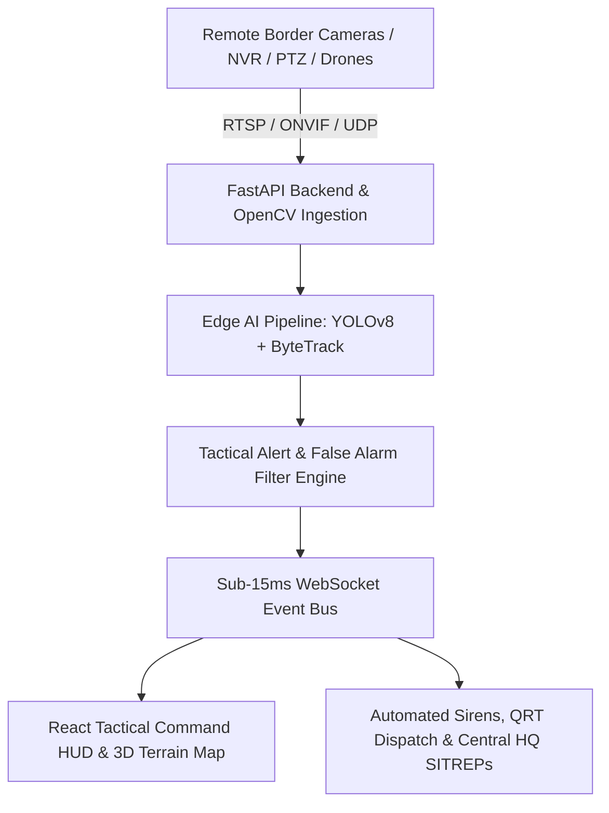

<div align="center">
  
  <h1>IBVAP — Intelligent Border Video Analytics Platform</h1>
  <p><strong>Next-Generation Autonomous Perimeter Defense, Dual-Spectrum Surveillance & 3D Tactical Terrain C2 Matrix</strong></p>

  [](https://www.python.org/)
  [](https://fastapi.tiangolo.com)
  [](https://reactjs.org/)
  [](https://www.typescriptlang.org/)
  [](https://maplibre.org/)
  [](https://tailwindcss.com/)
  [](#-zero-trust-access-control--default-credentials)
</div>

---

## 🌐 Live Production Deployments

| Component | Platform | Live URL |
|:---|:---|:---|
| **Frontend Command Center** | Vercel | [https://ibvap-1.vercel.app](https://ibvap-1.vercel.app) |
| **Backend REST & WebSocket API** | Render | [https://ibvap-backend-illu.onrender.com](https://ibvap-backend-illu.onrender.com) |
| **Interactive API Documentation** | Swagger UI | [https://ibvap-backend-illu.onrender.com/docs](https://ibvap-backend-illu.onrender.com/docs) |

---

## 🔑 Zero-Trust Access Control & Default Credentials

IBVAP implements strict, zero-trust role segregation between **Delhi Central HQ Supreme Command** and forward **Border Checkpost Commanders**.

### 1. Default Access Matrix

| Role | Officer Callsign | Access Cipher (Password) | Assigned Scope & Jurisdiction |
|:---|:---|:---|:---|
| **Central HQ Supreme Command** | `admin` | `Admin@IBVAP2026` | **Global National Grid**<br>• Full oversight across all 6 frontier sectors<br>• National SOC threat matrix & QRT alerts<br>• Officer appointment & Checkpost Commander governance<br>• Cryptographic Forensic Evidence Vault (SHA-256)<br>• System Health Center & server cluster telemetry |
| **Checkpost Commander (Punjab Sector)** | `officer_alpha` | `Officer@IBVAP2026` | **Attari-Wagah Border Outpost (`BOP-WAGAH`)**<br>• Isolated local checkpost surveillance & IP camera feeds<br>• Ground tactical PTZ joystick & optical zoom controls<br>• Drone fleet (UAV) patrols & target handoff<br>• Direct encrypted SITREP dispatch to Delhi Central HQ<br>• Virtual perimeter tripwire rules & local siren triggers |

> 💡 **Quick Login:** On the login screen, clicking the **"Central HQ"** or **"Checkpost Cmdr"** tab automatically fills the valid default credentials for testing.

### 2. Checkpost Commander Governance (HQ Admin Only)
- The Central HQ Admin can appoint new commanders and create checkposts directly inside the **"Checkpost Heads (Commanders)"** module (`#security`).
- Each appointed officer receives a designated callsign, outpost jurisdiction (e.g., Wagah, Munabao, Tanot, Sir Creek), and isolated perimeter permissions.

---

## 🛡️ Core Tactical Capabilities

### 1. 📹 Autonomous Video Ingestion & Multi-Camera Wall
- **Protocol Flexibility**: Ingests IP cameras via RTSP, ONVIF, NVR/DVR multi-channel, WebRTC, USB tactical webcams, and drone RTSP/UDP streams.
- **Dynamic Multi-Grid**: Seamless switching between 1x1 Focus, 2x2 Quad, 3x3 Tactical, and 4x4 High-Density 16-channel video walls.
- **Offline Edge Resilience**: Local checkposts record continuous FIFO video loops locally; low-bandwidth alerts and snapshots transmit to Central HQ even over degraded SATCOM links.

### 2. 🤖 Dual-Spectrum Edge AI (YOLOv8 + ByteTrack)
- **Zero-Lux Threat Detection**: Real-time fusion of 4K optical day-feeds and Long-Wave Infrared (LWIR) thermal sensors.
- **Persistent Object Tracking**: ByteTrack Kalman filtering maintains persistent IDs through foliage occlusions and temporary terrain masking.
- **False Alarm Suppression**: Suppresses non-threat movement (wind-blown shrubs, dust storms, small fauna) while pinpointing perimeter breaches, unauthorized vehicles, and weapon silhouettes.

### 3. ⛰️ 3D WebGL Mountain Terrain & Tactical GIS
- **Physical Elevation DEM**: Real 3D topographical raster-DEM elevation modeling with MapLibre GL WebGL, rendering actual ridgelines, mountain valleys, and riverbeds.
- **International Zero-Line Fencing**: Border security wire and camera FOV fan projections dynamically conform to 3D mountain slopes.
- **Tactical Navigation Modes**: Switchable satellite orthophoto, topographical contour, tactical dark canvas, and road grid views with 1-click sector jumps (Punjab, Rajasthan, J&K, Ladakh, Gujarat).

### 4. 🕹️ PTZ Optical Steering & Tactical Joystick
- Real-time Pan/Tilt/Zoom velocity steering with optical zoom presets (Gate, Wire, Recon, Long-Range).
- Automated ByteTrack target locking to steer motorized PTZ turrets following detected intrusion targets.

### 5. 🛸 Autonomous Drone (UAV) Fleet Operations
- Tactical aerial reconnaissance with waypoint mission planning (Patrol, Intercept, Recon).
- Ground-to-Air Track Handoff: Seamless target telemetry transfer from ground sentry cameras to airborne drones.

### 6. 🔒 Cryptographic Forensic Evidence Vault
- Automated snapshot capture of all intrusion triggers with immutable SHA-256 cryptographic hashes.
- Non-repudiation chain of custody logs, GPS metadata, and court-admissible audit reports.

### 7. 📡 Real-Time SITREP Uplink to Delhi HQ
- Instant checkpost Situation Reports (SITREPs) transmission from border outposts to Delhi Central HQ with live WebSocket synchronization.
- Automated priority escalation (Normal, Elevated, Critical) and one-click QRT reinforcement broadcast.

### 8. 🩺 System Health Center
- Subsystem diagnostics covering database connectivity, Redis/WebSocket bus, OpenCV camera streamer threads, and AI inference latency.
- Live telemetry stats with real-time refresh.

---

## 💻 Technology Architecture



| Layer | Technologies |
|:---|:---|
| **Frontend UI** | React 18, TypeScript, TailwindCSS, MapLibre GL JS (3D WebGL), Leaflet, Lucide Icons, Vite |
| **Backend Service** | FastAPI (Python 3.10+), Uvicorn ASGI, Pydantic v2, WebSockets, Starlette |
| **Vision & AI Engine** | OpenCV (cv2), Ultralytics YOLOv8, ByteTrack, PyTorch, NumPy |
| **Database & ORM** | PostgreSQL (Render Live) / SQLite (Local fallback), SQLAlchemy 2.0 |
| **Security Architecture** | Zero-Trust JWT Authentication, bcrypt password hashing, CORS protection |
| **Cloud Deployment** | Vercel (Frontend SPA) + Render (Cloud Web Service) |

---

## 🚀 Local Development Setup

### 1. Prerequisites
- **Python**: 3.10 or higher
- **Node.js**: 18 or higher (with npm)
- **Git**

### 2. Backend Setup
```bash
# Navigate to backend directory
cd backend

# Create and activate Python virtual environment
# On Windows:
python -m venv venv
.\venv\Scripts\Activate.ps1

# On Linux / macOS:
# python3 -m venv venv
# source venv/bin/activate

# Install dependencies
pip install -r requirements.txt

# Start the FastAPI server
uvicorn app.main:app --host 0.0.0.0 --port 8000 --reload
```
*Backend API will run at `http://localhost:8000` with Swagger docs at `http://localhost:8000/docs`.*

### 3. Frontend Setup
```bash
# Navigate to frontend directory
cd frontend

# Install Node dependencies
npm install

# Start the development server
npm run dev
```
*Frontend will run at `http://localhost:5173`.*

---

## 📱 Multi-Device & Mobile Responsiveness

IBVAP is optimized for all operational environments:
- **Large Video Walls & War Rooms**: 4K / 8K ultra-wide SOC displays.
- **Desktop & Laptop Workstations**: Checkpost command consoles.
- **Tablets & Field Terminals**: Mobile tactical field tablets with touch-friendly joystick and map navigation.
- **Mobile Handhelds**: Sentry mobile devices with a slide-out navigation drawer, touch backdrops, and compact HUD telemetry.

---

## 🇮🇳 Dedicated to the Sentinels of the Frontier

IBVAP is dedicated to the brave soldiers and sentinels of the **Border Security Force (BSF)**, **Indo-Tibetan Border Police (ITBP)**, and **Indian Armed Forces** guarding the frontiers 24/7.
