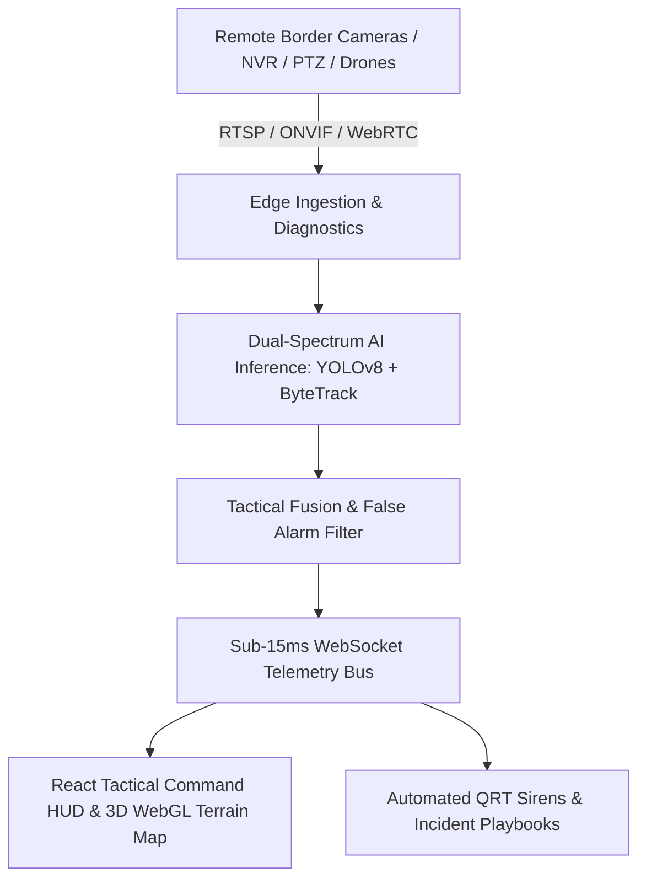

<div align="center">
  
  <h1>IBVAP — Intelligent Border Vision Analytics Platform</h1>
  <p><strong>Next-Generation Autonomous Perimeter Defense, Dual-Spectrum Surveillance & 3D Tactical Terrain C2 Matrix</strong></p>

  [](https://www.python.org/)
  [](https://fastapi.tiangolo.com)
  [](https://reactjs.org/)
  [](https://www.typescriptlang.org/)
  [](https://maplibre.org/)
  [](https://tailwindcss.com/)
  [](docs/SECURITY.md)
</div>

---

## 📌 Overview

**IBVAP (Intelligent Border Vision Analytics Platform)** is an enterprise-grade, mission-critical Command & Control (C2) situational awareness system engineered for national border defense operations.

The platform autonomously ingests 4K optical, PTZ, and Long-Wave Infrared (LWIR) thermal video streams from forward **Border Outposts (BOPs)** across national frontiers (Punjab, Rajasthan, Jammu, Gujarat, Kashmir, Ladakh, Bengal, Assam, etc.). It combines **real-time 3D WebGL Mountain Terrain visualization**, **Edge AI object tracking (YOLOv8 + ByteTrack)**, strict **role-based outpost isolation**, and **instant sub-15ms threat alerts** to empower commanders and Quick Reaction Teams (QRT).

---

## 🌟 Key Features & Capabilities



### 1. ⛰️ Realistic 3D WebGL Mountain Terrain & Tactical GIS
* **Physical Elevation**: Native WebGL 3D raster-DEM terrain powered by MapLibre GL JS with AWS Open Data Terrarium elevation tiles and `1.85x` vertical exaggeration. True ridgelines, peaks, valleys, and riverbeds render naturally.
* **Keyless Multi-Style Overlays**: 100% public, high-speed tile layers with zero paid API key dependencies:
  * 🛰️ **Satellite Mode**: High-resolution photorealistic aerial orthophotos (Esri World Imagery).
  * ⛰️ **Topographic Mode**: Elevation relief and contour lines (Esri World Topo).
  * 🛡️ **Dark Ops Mode**: High-contrast tactical night vision canvas (Esri Dark Canvas).
  * 🛣️ **Navigation Mode**: Tactical road and checkpost network (OpenStreetMap).
* **3D Border Wire & FOV Projections**: International zero-line perimeter fences and camera Field-of-View (FOV) fan cones dynamically conform to 3D mountain slopes.
* **Interactive 3D Controls**: Dedicated 3D D-pad (North, South, East, West), tilt angle toggle (65° oblique horizon view vs. top-down 2D radar), 360° bearing compass, and autonomous drone orbit flythrough.

### 2. 🎯 Multi-Tier Role Scoping & Outpost Perimeter Isolation
* **Super Admin Command Mode**:
  * Nationwide frontier navigation ribbon (Punjab, Rajasthan, Jammu, Gujarat, Kashmir, Ladakh, South Bengal, North Bengal, Tripura, Meghalaya, Mizoram, Assam).
  * Selecting any Frontier dynamically restricts the map and sensor feeds to **only the BOPs belonging to that Frontier** and **only the cameras attached to those BOPs**.
  * "All Frontiers" view unlocks national defense grid monitoring.
* **BOP Commander Mode**:
  * Strict outpost perimeter isolation: Commander sees **only their assigned Frontier**, **only their assigned BOP**, and **only cameras attached to their post**.
  * All foreign checkposts and unauthorized cameras across other borders are completely filtered out.

### 3. 📹 Dual-Spectrum Optical & Thermal Vision
* **Nocturnal Stealth Detection**: Seamlessly switches to LWIR thermal telemetry during zero-lux darkness, blizzard, or dense alpine fog.
* **False Alarm Suppression**: Filters out over 95% of false alarms caused by desert dust plumes, flowing river ripples, and stray wildlife.
* **Camera Lens Tamper & Blur Telemetry**: Evaluates Laplacian variance to detect lens occlusion, physical tampering, or fog build-up.

### 4. 🤖 Edge AI, ByteTrack & Movement Intelligence
* **Multi-Object Tracking**: ByteTrack Kalman filters assign persistent tracking IDs across occlusions, tree canopies, and temporary obstacles.
* **Geometric Virtual Fencing**: Arbitrary polygon intrusion zones, directional tripwires, and buffer exclusion zones.
* **Cross-Camera Handover (Re-ID)**: Re-identifies suspicious personnel or rogue vehicles across adjacent observation towers.

### 5. 🚨 Tactical Incident Command & QRT Dispatch
* **Instant Threat Broadcasting**: Sub-15ms automated audio sirens and visual alert broadcasts to on-duty commanders and QRT dispatchers.
* **Evidence Logging**: Forensic image snapshot logging with SHA-256 cryptographic hashes and GPS coordinates.
* **Tactical SOP Playbooks**: Automated response workflows mobilization for immediate border threat containment.

---

## 💻 Tech Stack

| Layer | Technologies |
|:---|:---|
| **Frontend** | React 18, TypeScript, Tailwind CSS, MapLibre GL JS, Leaflet, Lucide Icons, Vite |
| **Backend** | FastAPI (Python 3.10+), Uvicorn ASGI Server, Pydantic, WebSockets |
| **AI & Computer Vision** | OpenCV, YOLOv8, ByteTrack, PyTorch |
| **Database & ORM** | PostgreSQL / SQLite, SQLAlchemy 2.0 |
| **Security** | Zero-Trust JWT Authentication, AES-256 Fernet Encryption, Strict CORS |
| **Deployment** | Vercel (Frontend SPA) + Render (Backend Web Service) / Docker Compose |

---

## 🚀 Quick Start (Local Setup)

### 1. Backend Launch
```bash
cd backend
python -m venv venv

# Activate Virtual Environment (Windows: .\venv\Scripts\Activate.ps1 | Linux/macOS: source venv/bin/activate)
.\venv\Scripts\Activate.ps1

pip install -r requirements.txt
cp .env.example .env
python -m uvicorn app.main:app --host 0.0.0.0 --port 8000 --reload
```
*Backend API will be live at `http://localhost:8000` with Swagger Docs at `http://localhost:8000/docs`.*

### 2. Frontend Launch
```bash
cd frontend
npm install
npm run dev
```
*Frontend Command Center will be live at `http://localhost:5173`.*

---

## 🐳 Docker Deployment

Run the entire full-stack platform with a single command:

```bash
docker compose up -d --build
```

- **Frontend Portal**: `http://localhost:80`
- **Backend API**: `http://localhost:8000`

---

## 🔑 Default Login Credentials

| Role | Callsign / Username | Password | Operational Access Level |
|:---|:---|:---|:---|
| **Super Admin / National HQ** | `admin` | `AdminSecure@IBVAP2026!` | Full Multi-Frontier C2, All BOPs, Camera Management, System Health |
| **BOP Commander** | `officer_alpha` | `OfficerSecure@IBVAP2026!` | Assigned Outpost Perimeter, Outpost Cameras, Incident Response, QRT Dispatch |

---

## 📁 Project Directory Structure

```text
IBVAP-1/
├── backend/
│   ├── app/
│   │   ├── api/             # REST Endpoints (Cameras, Alerts, GIS, Drones, Health)
│   │   ├── core/            # Security, JWT, Encryption, Config
│   │   ├── models/          # Database Schemas & Pydantic Data Models
│   │   ├── services/        # Video Ingestion, YOLOv8, ByteTrack, WebSocket Bus
│   │   └── main.py          # FastAPI Application Gateway
│   ├── requirements.txt     # Python Dependencies
│   └── Dockerfile           # Backend Container Specification
├── frontend/
│   ├── src/
│   │   ├── components/      # 3D Map (MapLibre), Leaflet Map, Camera Modals, HUD
│   │   ├── pages/           # GIS Intelligence, Command Center, Health, Dispatches
│   │   ├── services/        # API Clients & Real-Time WebSocket Handlers
│   │   └── App.tsx          # Main React Application Router
│   ├── package.json         # Frontend Dependencies & Build Scripts
│   ├── vercel.json          # Production SPA Client-Side Routing
│   └── Dockerfile           # Multi-Stage Nginx Container Specification
├── docker-compose.yml       # Production Multi-Container Orchestration
└── README.md                # Master Documentation
```

---

## 🛡️ License & Defense Inspection Compliance

Built strictly in compliance with enterprise zero-trust security architectures, non-repudiation cryptographic audit logs, and defense-grade situational awareness standards.
